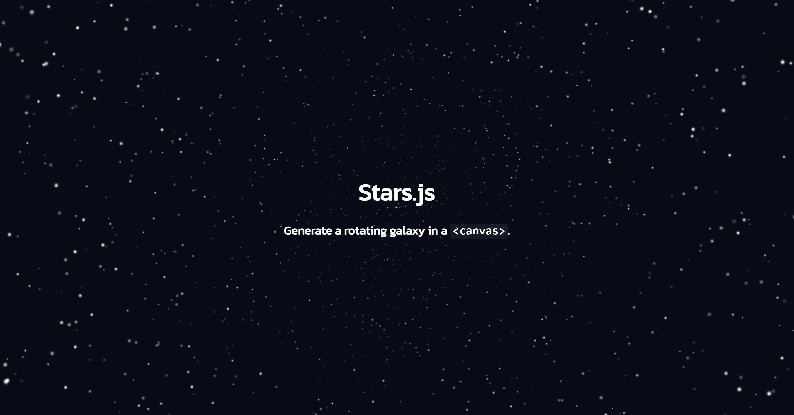

<h1 align="center">Stars.js</h1>

    ✨ Generate a rotating galaxy in a canvas.

    🚀 Check it out at <a href="https://danziger.github.io/starsjs/">https://danziger.github.io/starsjs/</a>!

 

    

 

Running It (Development)
------------------------

Take a look at `package.json`, the scripts are self-explanatory, but otherwise `npm install` and `npm start` work in `90%` of teh cases :D

The project will be accessible at http://localhost:8080/.

 

Reporting a problem
-------------------

Don't hesitate to report any issue you find in this website/project by opening a new issue in this repository, but please make sure that problem hasn't been reported before by another user.

 

TODOs & Bug
-----------

### Bugs

- Animate (fade-in) FPS meter.

 

### Stars Generation & Options

- Add a footer with an attribution.

- Make `twinkle` proportional to the distance to the center (so that the effect is more noticeable on larger stars that are further away from the center).

- Consider implementing the settings panel with a few different libraries to see the differences with a real example.

 

### Other Features

- Progressively highlight "Stars.js" letter as the animation loads.

- Animate "Starts.js" dot as a blinking star.

 

### Tech Debt

 

Options (to be implemented)
---------------------------

- Pattern:
    - Type: uniform, radial, linear
    - Direction: in, out, left, right, top, bottom, custom vector

- Movement:
    - Type: none, rotate, translate
    - Direction: clockwise, counterclockwise, left, right, top, bottom, custom vector
    - Speed

- Style:
    - Background color
    - Foreground gradient
    - Star color(s) / pattern(s)

- Performance:
    - Number of starts:
        - Total (raw number)
        - Density (stars per 100px^2)
        - Grouped (stars per group, each group is a pre-rendered set of 2-10 similar or equal stars)

- Mouse Interaction:
    - Type: none, tilt, translate / drag
    - Direction: away, towards
    - Duration: permanent, spring effect
    - Range / intensity
    - Acceleration / transition function

- Scroll Interaction:
    - Type: none, tilt, translate / drag
    - Direction: same, opposite
    - Duration: permanent, spring effect
    - Range / intensity
    - Acceleration / transition function

 

Settings Panel
--------------

I've been considering different libraries to implement the settings panel available on Stars.js to play around with the settings above (once they get implemented), and I thought the comparison might be relevant for some other people, so here it is (still in draft, I'll be adding more info soon).

- `dat.gui` - [Repo](https://github.com/dataarts/dat.gui), [Docs](https://github.com/dataarts/dat.gui/blob/master/API.md), `dat.gui migration guide`, [Demo (not official)](https://sbcode.net/threejs/dat-gui/), [NPM](https://www.npmjs.com/package/dat.gui)

  Monthly installs: X, Stars: X, Issues: X, Last updated: YYY.MM.DD

- `tweakpane` - [Repo](https://github.com/cocopon/tweakpane), [Docs](https://tweakpane.github.io/docs/), `dat.gui migration guide`, [Demo](), [NPM]()

  Monthly installs: X, Stars: X, Issues: X, Last updated: YYY.MM.DD

- `control-panel` - [Repo & Docs](https://github.com/freeman-lab/control-panel?tab=readme-ov-file), `dat.gui migration guide`, [Demo](https://control-panel.surge.sh/), [NPM]()

  Monthly installs: X, Stars: X, Issues: X, Last updated: YYY.MM.DD

- `guify` - [Repo](https://github.com/colejd/guify), [Docs](), `dat.gui migration guide`, [Demo](), [NPM]()

  Monthly installs: X, Stars: X, Issues: X, Last updated: YYY.MM.DD

- `lil-gui` - [Repo](https://github.com/georgealways/lil-gui), [Docs](https://lil-gui.georgealways.com/), `dat.gui migration guide`, [Demo](https://lil-gui.georgealways.com/examples/basic/), [NPM]()

  Monthly installs: X, Stars: X, Issues: X, Last updated: YYY.MM.DD

- `controlkit.js` - [Repo](https://github.com/automat/controlkit.js), [Docs](), `dat.gui migration guide`, [Demo](), [NPM]()

  Monthly installs: X, Stars: X, Issues: X, Last updated: YYY.MM.DD

- `oui` - [Repo](https://github.com/wearekuva/oui), [Docs](), `dat.gui migration guide`, [Demo](), [NPM]()

  Monthly installs: X, Stars: X, Issues: X, Last updated: YYY.MM.DD

- `palette.js` - [Repo](https://github.com/lehni/palette.js), [Docs](), `dat.gui migration guide`, [Demo](), [NPM]()

  Monthly installs: X, Stars: X, Issues: X, Last updated: YYY.MM.DD

- `quicksettings` - [Repo](https://github.com/bit101/quicksettings), [Docs](), `dat.gui migration guide`, [Demo](), [NPM]()

  Monthly installs: X, Stars: X, Issues: X, Last updated: YYY.MM.DD

- `paper-gui` - [Repo](https://github.com/google/paper-gui), [Docs](), `dat.gui migration guide`, [Demo](), [NPM]()

  Monthly installs: X, Stars: X, Issues: X, Last updated: YYY.MM.DD

 

### Comparison:

TODO: Add a table (maybe Airtable link) with:

- `dat.guy` drop-in replacement?
- Fields / attributes list.
- React library?
- Some links to projects using it (e.g. https://www.vantajs.com/).
- Dependencies / dependency-free.

 

Some other sites I've built
---------------------------

- **[GMZCODES](https://gmzcodes.com/)**

  👨‍💻 Dani Gamez's personal website PWA built using JavaScript, SCSS and HTML5.

- **[Stylophone.js](https://danziger.github.io/stylophonejs/)**

  🎹 The classic Stylophone, now in your phone and computer.

- **[Key.js](https://keyjs.dev)**

  ⌨ Press any key to get the JavaScript keyboard event event key, code, which, keyCode and more properties!

- **[Slot.js](https://danziger.github.io/slotjs/)**

  🎰 Circular slot machine mobile-first SPA built with JavaScript, CSS variables and Emojis!

- **[Job.js](https://danziger.github.io/jobjs/)**

  💼 Sharable image summaries for your open positions: Share your jobs as an image on LinkedIn and Instagram to get a visibility boost and more applicants!

 

Author
------

Dani Gámez Franco

LinkedIn: https://www.linkedin.com/in/danigamezfranco/

Stack Overflow: https://stackoverflow.com/users/3723993/danziger
